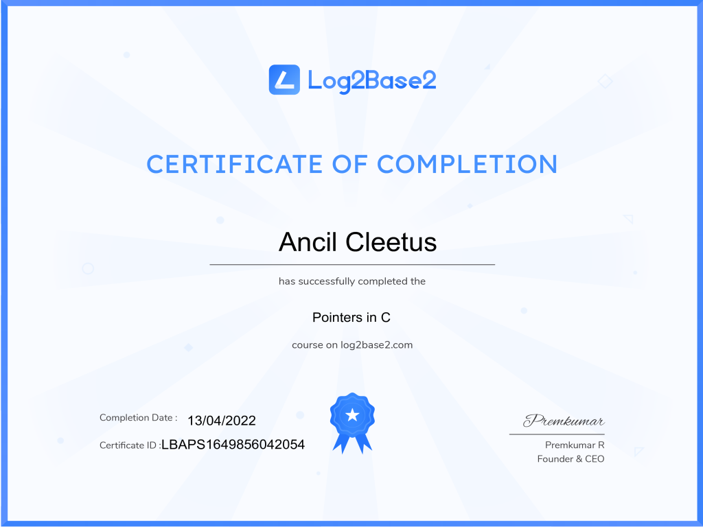

# C Fundamentals

## Certification 01: Log2Base2 C Programming Course
Issued Mar 2022  
Credential ID LBCPG1648710718254  
[See Credential](https://log2base2.com/Assets/Certificates/ancilcleetus.personal/C%20Programming)  

## Certification 02: Log2Base2 Pointers in C Course
Issued Apr 2022  
Credential ID LBAPS1649856042054  
[See Credential](https://log2base2.com/Assets/Certificates/ancilcleetus.personal/Pointers%20in%20C)  

